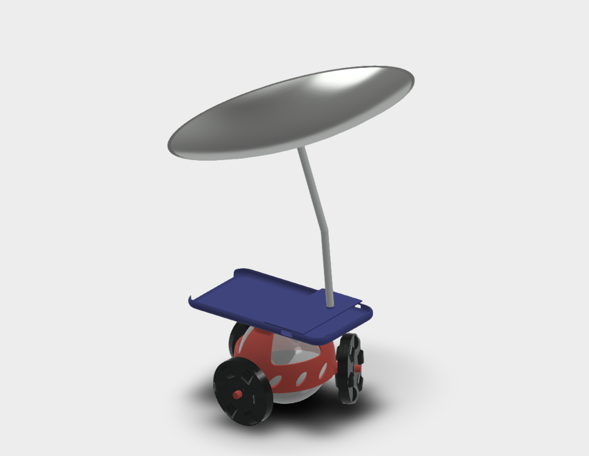

# SpheroLineTracer
## ライントレースしたい!
Spheroがかわいくて、これで何か作ろうと思ってたところで、ライントレースの大会があったなあと。

Spheroにラインセンサーはついてないのでどうしたものかと考えた結果、スマホを載せて画像認識することに。  

スマホとSpheroは独立に回転しちゃうので、全方位見る必要も出てきました。

## How it works?
### 外観

### 死角
支柱にさえぎれて、iPhoneの後ろ側が見えない。

## つくりかた
1. 3Dプリンタにcover.stlとiphone_case.stlを出力させる
2. なめらかオムニホイールをフランジ付きベアリングと一緒に挿して、スナップリングで固定
3. coverの上にiphone caseを載せて両面テープ等で固定
4. 曲面ミラーの真ん中に穴を開けて、凹面側にスペーサーをボルト固定
5. スマホを入れてみて、フロントカメラにミラー全体が写るようスペーサーの長さ角度を調整
6. スペーサーをつなげて、iphone caseの穴に差し込む。接着剤を流し込むと良い。
7. iPhoneにXcodeからアプリ入れたら完成！

※曲面ミラー：東急ハンズのネットショップにないのに店舗行ったら置いてあった。球面なのか、はたまた回転放物面なのか何なのかは不明。

## 現状
ライントレースします、が、

- 今進んでる線の隣の線を見たり、
- 死角が大きいので、曲率の小さすぎるカーブの中でラインが見えず迷子になったり
- 180°向きを変えるようなカーブも苦手です。

進行方向のラインをたまに見失って、来た道を引き返すのがよく見られました。

改善の余地はまだまだありそうです。

## 改善点
- 機体の剛性
	* ロボット落として２回も足折った。。
- ミラーの固定方法
	* 死角が出来ないように透明な筒でミラーの周囲を固定
- 画像認識の改良
	* 直線上にいなくても、ミラーに映る直線を検出・進行方向を推定(要：曲面画像の平面への変換)
	* 明るさでなく色相でのライン識別
	* 二値化の閾値を自動調整
- コース記憶による加減速走行
	* Spheroにエンコーダー乗ってるので、コース1周目で道を覚えて、2周目は画像認識せずに爆速で走れたらカッコイイ
	* ただし、Spheroと地面が滑るとまずい

## 参考
- [Sphero Docs](http://sdk.sphero.com)
	* Spheroの基本的なことから、SDKの使い方まで

- [Objective-C フラグメントシェーダー事始め](http://program.station.ez-net.jp/special/objective-c/fragment-shader.asp)  
	* GLESについて日本語で詳しく書いてあるのはこれぐらい？